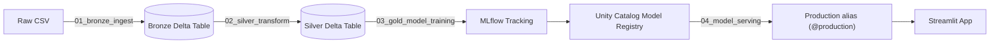

# Customer Churn Prediction — Databricks Lakehouse Edition

A rebuild of the original [churn-prediction](https://github.com/tusharraj684-dotcom/churn-prediction)
project on Databricks Free Edition, following the bronze → silver → gold
lakehouse pattern, with MLflow experiment tracking, Unity Catalog model
registry, and a real, evidence-based model comparison — not just a single
model trained once.

## Why this exists

The original project proved the modeling and business-storytelling skills.
This version proves the platform skills — Delta Lake, PySpark at scale,
Unity Catalog, and MLflow as the backbone of a reproducible ML
workflow — the ones a Databricks partner (like Celebal) actually hires for.

## Results

| Model                                   | F1 (churn class) | ROC-AUC | Notes |
|------------------------------------------|-------------------|---------|-------|
| Original pandas pipeline (baseline)       | 0.60              | —       | From the first version of this project |
| XGBoost + GridSearchCV + SMOTE            | 0.6294            | 0.842   | First Databricks iteration |
| XGBoost + `scale_pos_weight` (no SMOTE)   | 0.6408            | 0.845   | Beat SMOTE — tree models handle imbalance natively |
| **CatBoost (native categorical handling)**| **0.6442**        | **0.845** | **Final model — registered as Production** |

**A negative result, kept intentionally:** an added feature-engineering pass
(contract × tenure interaction, charges-to-tenure ratio, expanded service
counts) was tried and *slightly hurt* performance (0.6408 → 0.6370 on
XGBoost), likely due to new features overlapping with existing ones and
adding noise on a dataset this size (~7K rows). The features were reverted
rather than kept — this is documented deliberately, because "I tried it,
measured it, and reverted it" is a better signal of real experimentation
than every attempt magically working.

**Why not push F1 to 0.90+?** This dataset (IBM/Kaggle Telco Customer
Churn) is heavily benchmarked publicly, and published results — including
deep tuning and ensembling — top out around 0.62–0.68 F1 for the churn
class. The ceiling comes from the data itself: available features (contract,
tenure, charges, add-ons) only partially explain churn, which also depends
on factors not captured here (competitor offers, service complaints, life
events). A suspiciously high F1 on this dataset is a stronger signal of
leakage or a mislabeled metric than of a better model.

## Architecture

| Layer  | Notebook                    | What it does                                                              |
|--------|------------------------------|----------------------------------------------------------------------------|
| Bronze | `01_bronze_ingest.py`        | Raw CSV → Delta table (Unity Catalog volume), no cleaning, full history via Delta time travel |
| Silver | `02_silver_transform.py`     | PySpark cleaning (fixes the `TotalCharges` blank-string bug explicitly), feature engineering |
| Gold   | `03_gold_model_training.py`  | 4 models compared: Logistic Regression, XGBoost (SMOTE), XGBoost (`scale_pos_weight`), CatBoost — all logged to MLflow with SHAP explainability |
| Serve  | `04_model_serving.py`        | Loads the registered model by name + alias (`@production`) for inference |

## Setup (Databricks Free Edition)

Databricks retired manual cluster creation for new accounts in favor of
**serverless-only compute** and **Unity Catalog by default**. A few things
that differ from older tutorials/guides:

- No "Compute > Create Cluster" step — notebooks attach to Serverless automatically.
- Data lives in **Unity Catalog volumes** (`/Volumes/catalog/schema/volume/file.csv`), not the old DBFS `/FileStore/` paths.
- The default catalog is typically named `workspace`, not `hive_metastore`.
- The Model Registry uses **aliases** (`@production`) instead of the old **stages** (`/Production`) system — `mlflow.pyfunc.load_model("models:/name@production")`, not `"models:/name/Production"`.
- Models registered in Unity Catalog **require a model signature** (input/output schema) — `mlflow.<flavor>.log_model(..., signature=..., input_example=...)` is mandatory, not optional.

### Steps

1. Sign up at [databricks.com](https://www.databricks.com) for Free Edition
2. Download the [Telco Customer Churn dataset](https://www.kaggle.com/datasets/blastchar/telco-customer-churn) from Kaggle
3. In Catalog, create a schema (`churn_project`) and a Volume inside it, then upload the CSV there
4. Import the 4 `.py` files as notebooks (Workspace > Import)
5. Run in order: `01` → `02` → `03` → `04`, updating the `catalog`/`raw_path` widgets to match your workspace's actual catalog name and upload path

## What to say about it in an interview

- **"Why Delta Lake and not just Parquet?"** — ACID writes, schema
  enforcement, and time travel (`DESCRIBE HISTORY`) so a bad ingestion run
  can be rolled back instead of corrupting downstream tables.
- **"Why bronze/silver/gold?"** — separates concerns: bronze is an
  untouched audit trail, silver is where data-quality bugs (like the
  `TotalCharges` issue) get fixed *visibly*, gold is analysis-ready.
- **"Why compare 4 models instead of picking one?"** — SMOTE vs.
  `scale_pos_weight` is a real, testable question for imbalanced data;
  measuring it rather than assuming an answer is the point. CatBoost's
  native categorical handling ended up mattering more than manual
  hyperparameter tuning.
- **"What about the feature engineering that didn't help?"** — kept as a
  documented negative result rather than hidden — shows the process
  included evaluation, not just addition.
- **"Stages vs. aliases in Unity Catalog?"** — the classic MLflow registry
  used stages (None/Staging/Production); Unity Catalog replaced this with
  aliases, which are more flexible (multiple named aliases per model) but
  require updating any code written against the old API.
- **"What would change at 10x the data?"** — move the pandas/sklearn
  training step to `pyspark.ml` so training itself distributes across the
  cluster, not just ingestion and feature engineering.

## Relationship to the original project

Same dataset, same core modeling decisions (F1 as the primary metric, SHAP
for explainability), same key bug story (`TotalCharges`). What changed is
the platform underneath, plus a more rigorous model comparison — this is
the answer to "have you used Databricks" backed by something real, built
and debugged end-to-end, rather than a definition memorized the night
before.
